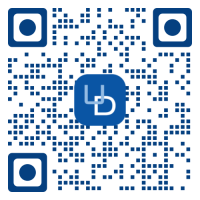

# Plugin Spotlight

## Hunter Douglas Shade Automation

Hunter Douglas Plugin is another in the long line of plugins to make your home
more comfortable, private and safe with your eisy/Polisy. It will help you keep
your home cool in the summer, warm in the winter, & private when you want it.
You can respond when shades are moved, or scenes are activated.
You can initiate scenes or custom movement in your shades.
You can be alerted using Instant Notifications and see/control everything on UD Mobile!

## WHAT YOU CAN DO

- See the status of all Hunter Douglas shades including:
  - Position
  - Capabilities
  - Motion
  - Battery
- Control any shade with Open/Close, Tilt, Jog commands
- See if any defined scene have been activated
- Control a scene Activating it
- Program any combination of devices with the above to the limits of your imagination!
- Get instant push notifications of any/all events you desire
- Works great in UD Mobile Android and iOS
- Checkout everything you can do with this **[Plugin here](screenshots.md)**

## COST

$10 one-time fee.

## PREREQUISITES

- eisy or Polisy firmware version **5.6.4 and above**

## OPTIONS

- UD Mobile for remote control
- Notifications plugin for instant push notifications
- or use built-in Network Resources to send to UD Mobile

## INSTRUCTIONS

For instructions and help, please visit the Hunter Douglas Plugin’s GitHub site
**[github site](https://github.com/sejgit/udi-hunterdouglas-pg3 "udi-hunterdouglas-pg3")**.
There is also
**[configuration help](https://github.com/sejgit/udi-hunterdouglas-pg3/blob/master/POLYGLOT_CONFIG.md)**.
Hunter Douglas Plugin also has a
**[dedicated forum](https://forum.universal-devices.com/forum/439-hunter-douglas/)**.

## ARE YOU STILL HESITANT UPGRADING YOUR 994 TO EISY?

Perhaps we can help!

- If your hesitation is because of the requirement to upgrade your 994 firmware
from 4.9 to 5.3.4, please contact us and we’ll help you migrate your backup

