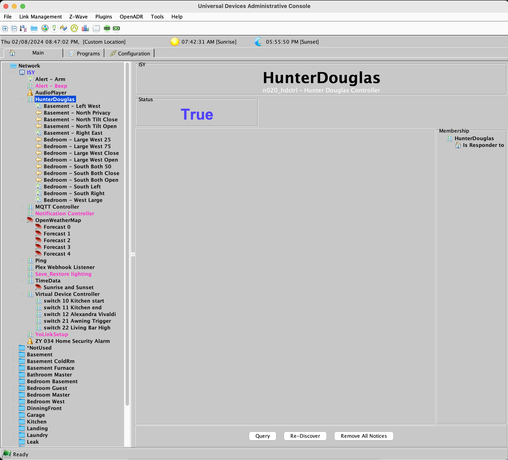
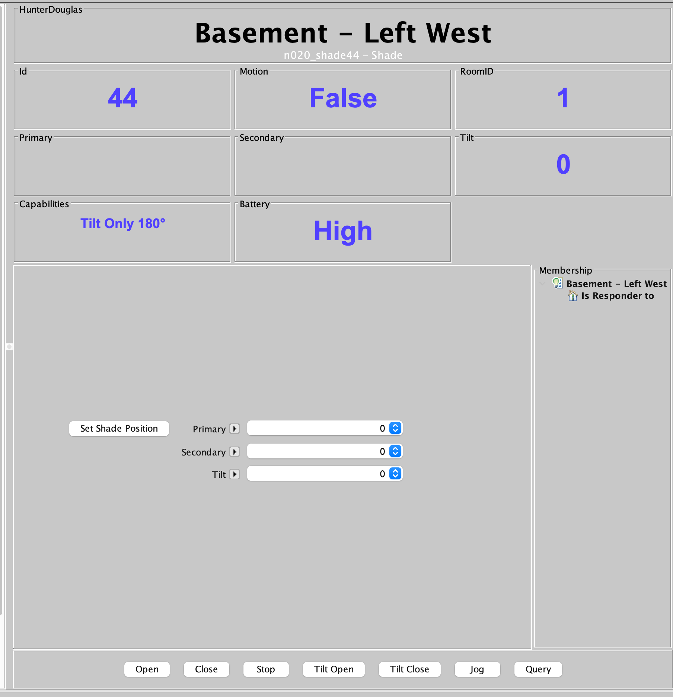
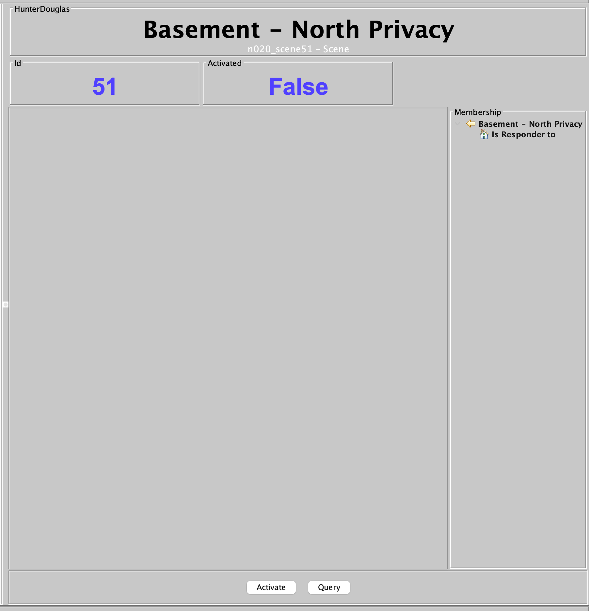
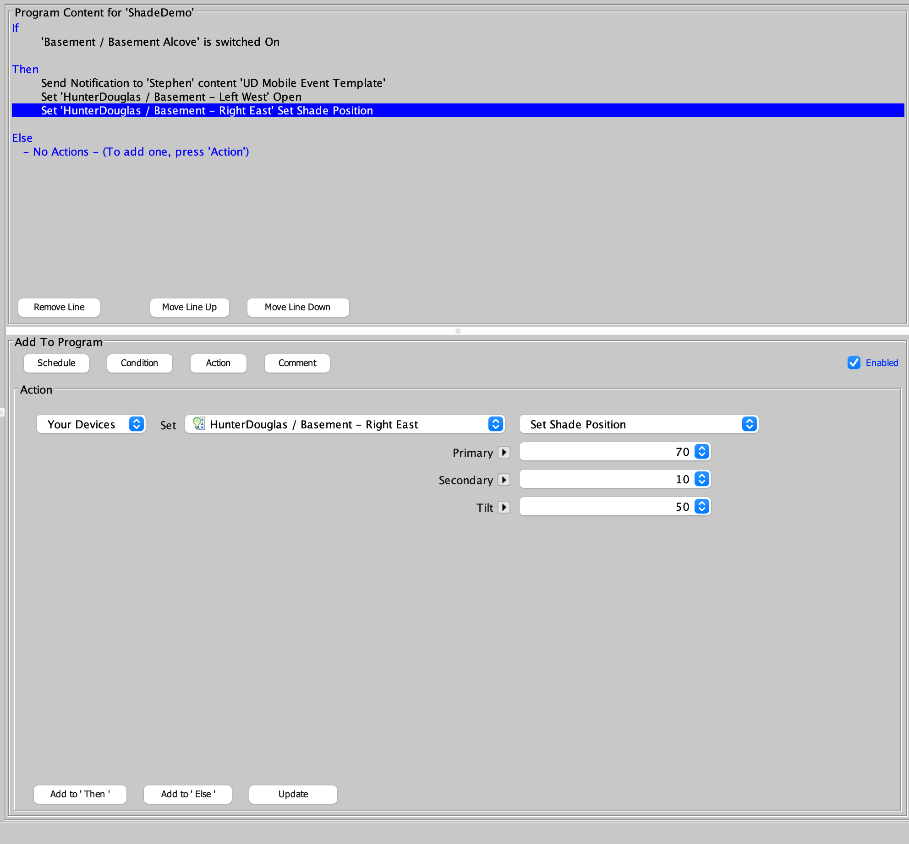
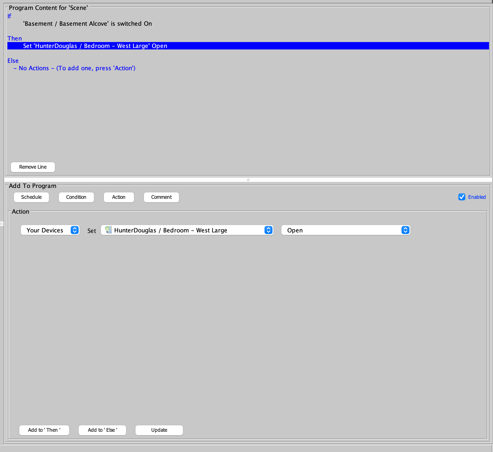
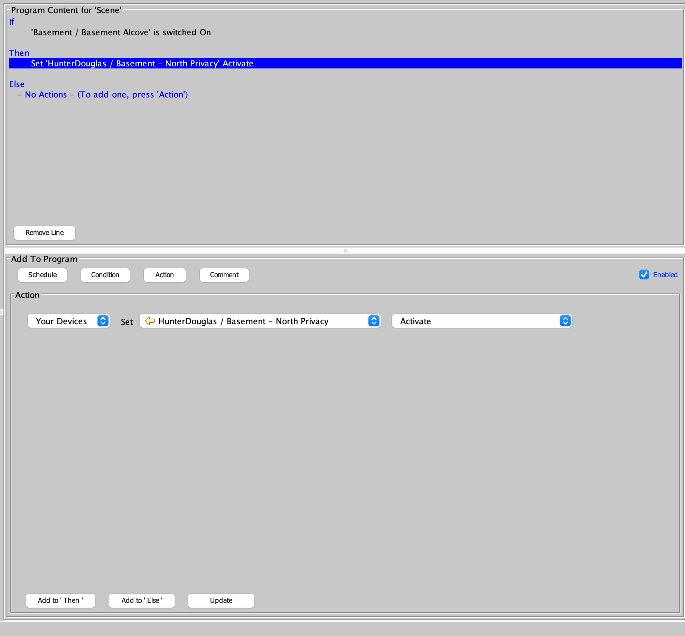
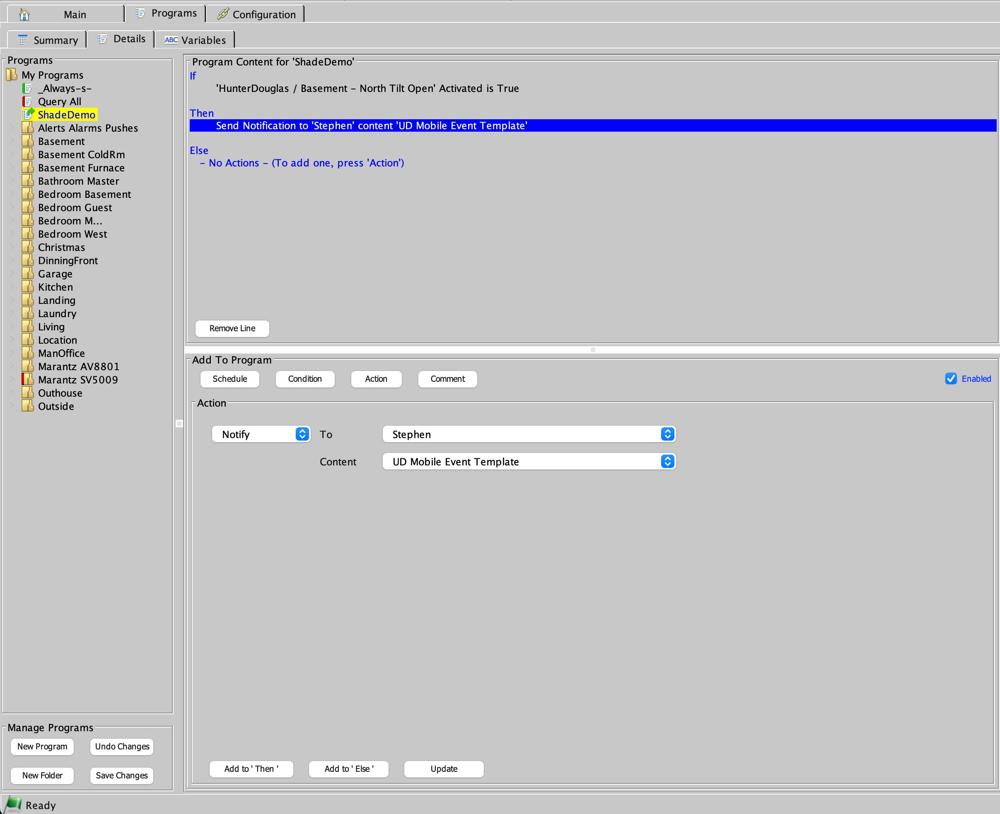

# Hunter Douglas Plugin Screenshots

## Controller Node

- Discover new shades or scenes
- Force query / update of status
- Clear messages

## Shade Node

- Status of
  - Shade capabilities
  - Current position and tilt
  - Is shade in motion?
  - Room
  - Battery Low / Medium / High
- Control
  - Set precise position / tilt
  - Open / Close / Stop
  - Tilt Open / Close
  - Jog
  

## Scene Node

- Status of scene activation
- Trigger activation of scene

## Program example: Shade Precise Position

- Based on any eisy / polisy condition move a shade to precise position

## Program example: Shade Open / Close / Tilt / Jog

- Simple movement of shade based on an eisy / polisy condition

## Program example: Scene Activation

- Activate a scene based on an eisy / polisy condition

## Program example: Notification

- notify you based on shade position or scene activation
- even if the shade or scene was moved manually or by the HD remote

